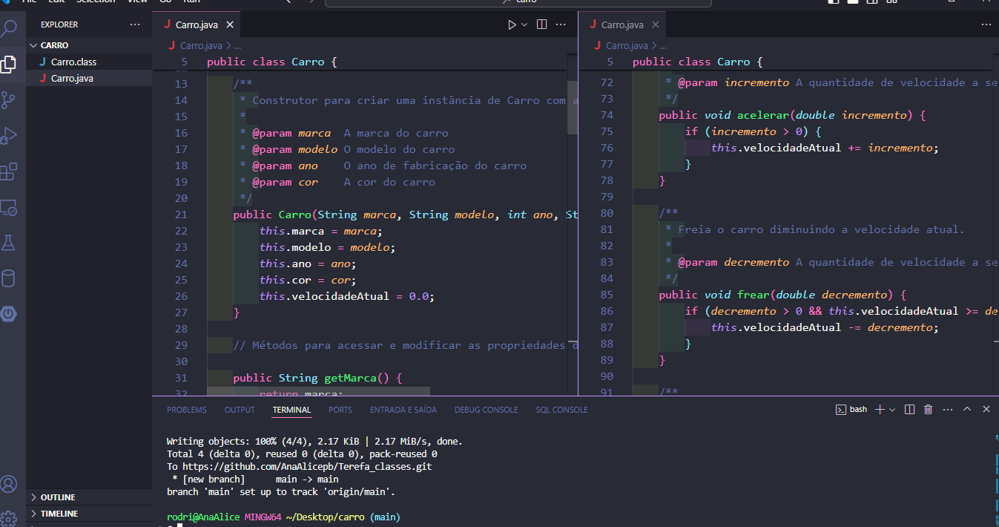

<!DOCTYPE html>
<html lang="pt-br">
<head>
    <meta charset="UTF-8">
    <meta name="viewport" content="width=device-width, initial-scale=1.0">
    <meta name="description" content="Projeto de exemplo que demonstra a criação e manipulação de um objeto Carro em Java.">
    <meta name="keywords" content="Java, Carro, Projeto, VS Code">
    <meta name="author" content="Ana Alice Rodrigues">
    
</head>
<body>

<header>
    <h1>Projeto Carro</h1>
    
</header>

    
Índice

    <ol>
        <li><a href="#sobre-o-projeto">Sobre o projeto</a></li>
        <li><a href="#parte-tecnica">Parte Técnica</a></li>
        <li><a href="#estrutura-dos-arquivos">Estrutura dos Arquivos</a></li>
        <li><a href="#casos-de-uso">Casos de Uso</a></li>
        <li><a href="#ferramentas">Ferramentas</a></li>
        <li><a href="#contato">Contato</a></li>
    </ol>

<section id="sobre-o-projeto">
    <h2>Sobre o projeto</h2>
    

        Este projeto demonstra a criação e manipulação de um objeto Carro em Java, incluindo propriedades e métodos que definem seu comportamento.
    

    

        Proposta de Valor: Oferecer um exemplo educacional simples de programação orientada a objetos utilizando a linguagem Java.
    

</section>

<section id="parte-tecnica">
    <h2>Parte Técnica</h2>
    <ul>
        <li>IDE utilizada: Visual Studio Code</li>
    </ul>
</section>

<section id="estrutura-dos-arquivos">
    <h2>Estrutura dos Arquivos</h2>
    <ul>
        <li><strong>Carro.java</strong>: Arquivo principal que contém a classe Carro com suas propriedades e métodos.</li>
    </ul>
</section>

<section id="casos-de-uso">
    <h2>Casos de Uso</h2>
    <ul>
        <li>Criação de um objeto Carro e manipulação de suas propriedades.</li>
        <li>Exibição das informações do Carro no console.</li>
        <li>Aceleração e frenagem do Carro, alterando sua velocidade atual.</li>
    </ul>
</section>

<section id="ferramentas">
    <h2>Ferramentas</h2>
    <ul>
        <li></li>
        <li></li>
        <li></li>
    </ul>
</section>

<section id="contato">
    <h2>Contato</h2>
    <ul>
        <li></li>
</ul>
   
</section>

</body>
</html>
